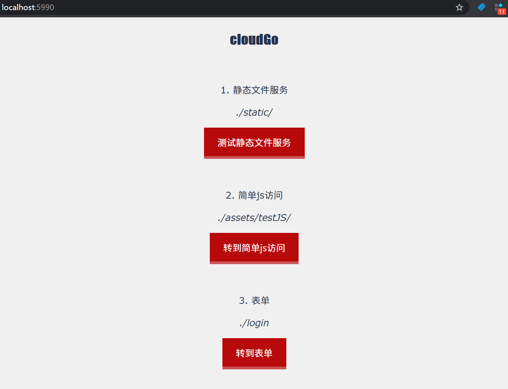
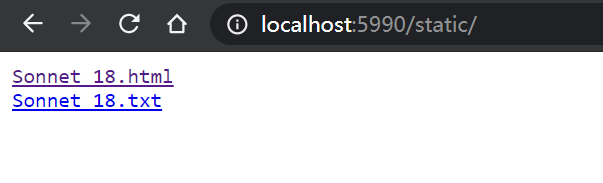
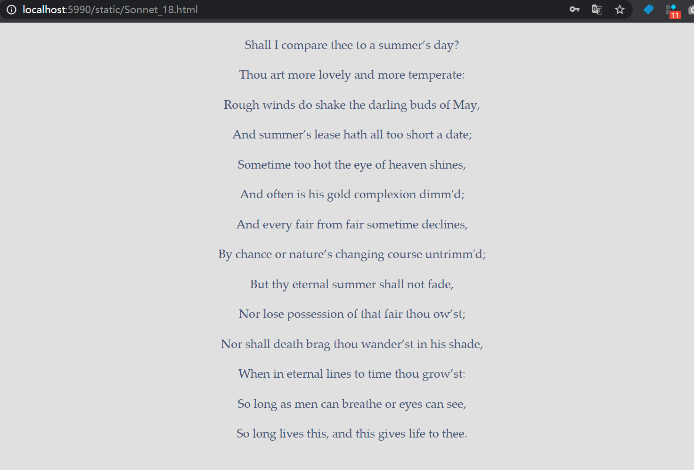
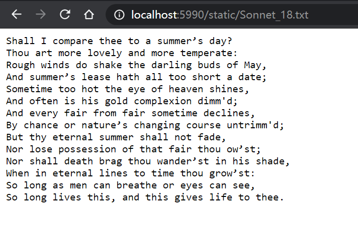
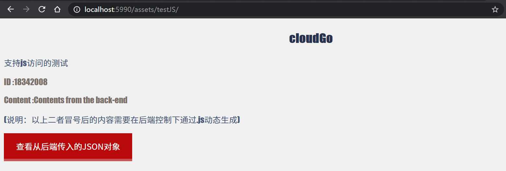
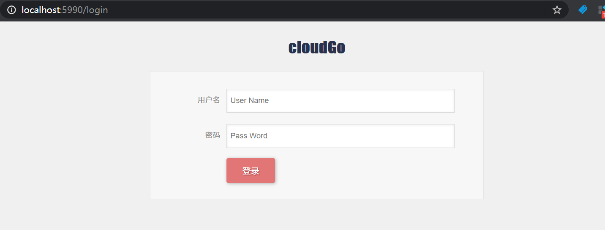
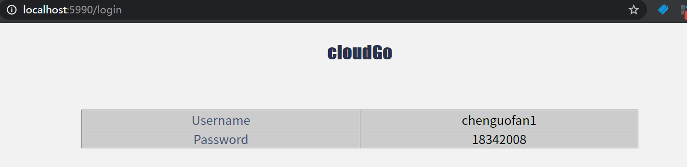
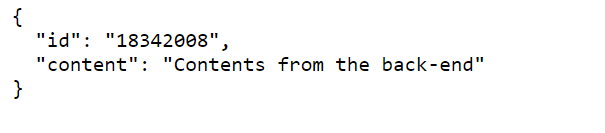

# cloudgo


[](https://sourcegraph.com/github.com/chenguofan1999/cloudgo)


## 这是什么?

这是中山大学服务计算课(2020)的[ 开发 web 服务程序 ](https://pmlpml.gitee.io/service-computing/post/ex-cloudgo-start/)作业，我的实现。

cloudgo 是一个 go web 服务程序，提供：
- 静态文件服务
- 简单 js 访问
- 表单提取服务

**注意：** 如果你是TA，请前往 [报告文档](report.md) 查看 curl、apache 的测试。  
**注意：** 这是一个初学者项目，不值得开发者参考。

## 部署和使用

**部署**

```
git clone http://https://github.com/chenguofan1999/cloudgo.git
```

进入 `test` 文件夹，启动 web 服务，

```
go run main.go
```

部署完毕。

**使用**

默认的端口是5990，您可以在 `main.go` 中更改。在浏览器中输入地址：`localhost:5990`, 浏览器显示以下页面：



### 静态文件服务

静态文件服务的 url 是 `localhost:5990/static/` , 主页面提供了跳转按钮。



查看第一个文件：



查看第二个文件：



终端显示：

```
$ go run main.go
[negroni] listening on :5990
[negroni] 2020-11-22T11:48:19+08:00 | 200 |      2.9369ms | localhost:5990 | GET /
```

### 简单的 js 访问

此部分的 url 是 `localhost:5990/assets/testJS/` , 主页面提供了跳转按钮。



### 表单服务

此部分的 url 是 `localhost:5990/login` , 主页面提供了跳转按钮。



随便填入一组数据：(chenguofan1, 18342008)




## 实现细节

### 静态文件服务


这里的静态文件服务通过 `html.FileServer` 直接建立在 `assets/testStaticFiles` 上。

```go
router.PathPrefix("/static/").Handler(http.StripPrefix("/static/", http.FileServer(http.Dir("assets/testStaticFiles"))))
```


### 简单的 js 访问

事实上在 `"/"`上也通过 `html.FileServer` 建立了文件服务，对应的 Dir 就是`main.go` 所在的位置，因此 `localhost:5990/assets/testJS/` 将进入 `/assets/testJS/` 文件夹。这里放置了演示的 `index.html`，因此在通过 go 提供的静态文件服务访问该文件夹时会直接进入对应的 web 页面。


注意，原始的 `index.html` 文件中并无 ID 和 Content 冒号后的内容，

`assets/testJS/index.html`
```html
<!DOCTYPE html>
<html>

<head>
    ...
    <script src="js/hello.js"></script>
</head>

<body>
...
    <p class="greeting-id">ID :</p>
    <p class="greeting-content">Content :</p>
...
</body>

</html>
```

这部分内容实际上是由 **web server 控制访问 js 来添加到 html 文件**的。

- web server 中对应代码：

    `server.go`
    ```go
    router.HandleFunc("/js", jsonHandler)
    ```


    `Handlers.go`
    ```go
    func jsonHandler(w http.ResponseWriter, req *http.Request) {
        formatter := render.New(render.Options{
            IndentJSON: true,
        })
        formatter.JSON(w, http.StatusOK, struct {
            ID      string `json:"id"`
            Content string `json:"content"`
        }{ID: "18342008", Content: "Contents from the back-end"})
    }
    ```

    `jsonHandler` 将一个 json 结构传给了 .js 文件, 可通过 `localhost:5990/js` 或此页面中的按钮跳转查看该 json 结构：

    

- 对应的 js 代码:  
(由上面的`index.html` 中的 `<script src="js/hello.js"></script>` 引入)

    `assets/testJS/js/hello.js`

    ```js
    $(document).ready(function() {
        $.ajax({
            url: "/js"
        }).then(function(data) {
        $('.greeting-id').append(data.id);
        $('.greeting-content').append(data.content);
        });
    });
    ```

### 表单服务

`server.go`

```go
router.HandleFunc("/login", loginHandler)
```

`Handlers.go`

```go
func loginHandler(w http.ResponseWriter, r *http.Request) {
	fmt.Println("method:", r.Method) //获取请求的方法
	if r.Method == "GET" {
		// 此地址相对于 main 程序位置
		t, _ := template.ParseFiles("assets/testInput/login.gtpl")
		log.Println(t.Execute(w, nil))
	} else {
		//请求的是登录数据，那么执行登录的逻辑判断
		r.ParseForm()

		formatter := render.New(render.Options{
			Directory:  "templates",
			Extensions: []string{".html"},
			IndentJSON: true,
		})

		formatter.HTML(w, http.StatusOK, "index", struct {
			Un string `json:"username"`
			Pw string `json:"password"`
		}{Un: r.Form["username"][0], Pw: r.Form["password"][0]})
	}
}
```

1. 首次访问 `localhost:5990/login` 时，向服务器发出方法为 "GET" 的 http 请求， 此时将会通过 `template.ParseFiles()` 动态加载出含表单的页面。
2. 当点击登录按钮时，由于这一按钮类型为 submit ，
    ```html
    <input type="submit" class="button" value="登录" />
    ```
    会向服务器发出方法为 "POST" 的 http 请求，此时执行 else 中的语句：
    1. 通过 ParseForm() 解析表单变量。
    2. 通过 render ，找到 `templates/` 中的带表格的模板 `index.html`，传入解析得到的变量，向 http.ResponseWriter 写入此 html 对象，完成表格页面的生成。