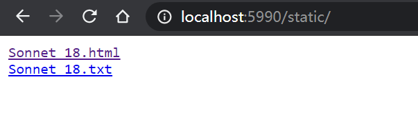
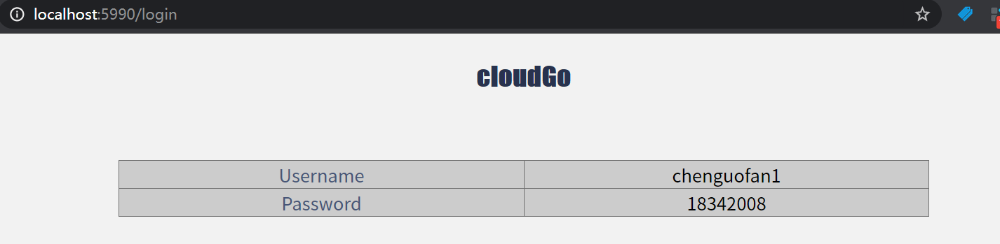

# curl & apache 测试报告

## 主页

**web页面**


**curl**

```
$ curl -v http://localhost:5990/
*   Trying 127.0.0.1:5990...
* TCP_NODELAY set
* Connected to localhost (127.0.0.1) port 5990 (#0)
> GET / HTTP/1.1
> Host: localhost:5990
> User-Agent: curl/7.68.0
> Accept: */*
>
* Mark bundle as not supporting multiuse
< HTTP/1.1 200 OK
< Accept-Ranges: bytes
< Content-Length: 1228
< Content-Type: text/html; charset=utf-8
< Last-Modified: Sun, 22 Nov 2020 02:37:54 GMT
< Date: Sun, 22 Nov 2020 04:12:16 GMT
<
<!DOCTYPE html>
<html>

<head>
    <title>CloudGo</title>
    <link rel="stylesheet" type="text/css" href="assets/mainPage/css/style.css">
</head>

<body>
    <h2 style="text-align: center;"><span style="font-family: Impact, Charcoal, sans-serif; color: rgb(40, 50, 78);">cloudGo</span></h2>
    <br>
    <p><span style="font-family: Verdana, Geneva, sans-serif; color: rgb(40, 50, 78);">1. 静态文件服务</span></p>
    <p><span style="font-family: Verdana, Geneva, sans-serif; color: rgb(40, 50, 78);"><em>./static/</em></span></p>
    <p><a href="./static/">测试静态文件服务</a></p>
    <br>
    <p><span style="font-family: Verdana, Geneva, sans-serif; color: rgb(40, 50, 78);">2. 简单js访问</span></p>
    <p><span style="font-family: Verdana, Geneva, sans-serif; color: rgb(40, 50, 78);"><em>./assets/testJS/</em></span></p>
    <p><a href="./assets/testJS/">转到简单js访问</a></p>
    <br>
    <p><span style="font-family: Verdana, Geneva, sans-serif; color: rgb(40, 50, 78);">3. 表单</span></p>
    <p><span style="font-family: Verdana, Geneva, sans-serif; color: rgb(40, 50, 78);"><em>./login</em></span></p>
    <p><a href="./login">转到表单</a></p>
</body>

* Connection #0 to host localhost left intact
</html>%
```

**Apache**

```
$ ab -n 1000 -c 100 http://localhost:5990/
This is ApacheBench, Version 2.3 <$Revision: 1843412 $>
Copyright 1996 Adam Twiss, Zeus Technology Ltd, http://www.zeustech.net/
Licensed to The Apache Software Foundation, http://www.apache.org/

Benchmarking localhost (be patient)
Completed 100 requests
Completed 200 requests
Completed 300 requests
Completed 400 requests
Completed 500 requests
Completed 600 requests
Completed 700 requests
Completed 800 requests
Completed 900 requests
Completed 1000 requests
Finished 1000 requests


Server Software:
Server Hostname:        localhost
Server Port:            5990

Document Path:          /
Document Length:        1228 bytes

Concurrency Level:      100
Time taken for tests:   0.080 seconds
Complete requests:      1000
Failed requests:        0
Total transferred:      1414000 bytes
HTML transferred:       1228000 bytes
Requests per second:    12570.39 [#/sec] (mean)
Time per request:       7.955 [ms] (mean)
Time per request:       0.080 [ms] (mean, across all concurrent requests)
Transfer rate:          17357.95 [Kbytes/sec] received

Connection Times (ms)
              min  mean[+/-sd] median   max
Connect:        0    1   1.1      0       6
Processing:     0    7   5.5      5      36
Waiting:        0    6   5.2      4      36
Total:          0    7   5.4      6      36

Percentage of the requests served within a certain time (ms)
  50%      6
  66%      8
  75%      9
  80%     11
  90%     15
  95%     16
  98%     25
  99%     26
 100%     36 (longest request)

```

## 测试静态文件服务

**web页面**



查看第一个文件：


查看第二个文件：


**curl**

```
$ curl -v http://localhost:5990/static/
*   Trying 127.0.0.1:5990...
* TCP_NODELAY set
* Connected to localhost (127.0.0.1) port 5990 (#0)
> GET /static/ HTTP/1.1
> Host: localhost:5990
> User-Agent: curl/7.68.0
> Accept: */*
>
* Mark bundle as not supporting multiuse
< HTTP/1.1 200 OK
< Content-Type: text/html; charset=utf-8
< Last-Modified: Sat, 21 Nov 2020 06:58:56 GMT
< Date: Sun, 22 Nov 2020 04:09:20 GMT
< Content-Length: 99
<
<pre>
<a href="Sonnet_18.html">Sonnet_18.html</a>
<a href="Sonnet_18.txt">Sonnet_18.txt</a>
</pre>
* Connection #0 to host localhost left intact
```

**Apache**

```
$ ab -n 1000 -c 100 http://localhost:5990/static/
This is ApacheBench, Version 2.3 <$Revision: 1843412 $>
Copyright 1996 Adam Twiss, Zeus Technology Ltd, http://www.zeustech.net/
Licensed to The Apache Software Foundation, http://www.apache.org/

Benchmarking localhost (be patient)
Completed 100 requests
Completed 200 requests
Completed 300 requests
Completed 400 requests
Completed 500 requests
Completed 600 requests
Completed 700 requests
Completed 800 requests
Completed 900 requests
Completed 1000 requests
Finished 1000 requests


Server Software:
Server Hostname:        localhost
Server Port:            5990

Document Path:          /static/
Document Length:        99 bytes

Concurrency Level:      100
Time taken for tests:   0.098 seconds
Complete requests:      1000
Failed requests:        0
Total transferred:      261000 bytes
HTML transferred:       99000 bytes
Requests per second:    10159.71 [#/sec] (mean)
Time per request:       9.843 [ms] (mean)
Time per request:       0.098 [ms] (mean, across all concurrent requests)
Transfer rate:          2589.54 [Kbytes/sec] received

Connection Times (ms)
              min  mean[+/-sd] median   max
Connect:        0    1   0.9      1       5
Processing:     0    9   6.4      7      33
Waiting:        0    8   6.1      6      32
Total:          0    9   6.3      8      34

Percentage of the requests served within a certain time (ms)
  50%      8
  66%     11
  75%     13
  80%     14
  90%     18
  95%     19
  98%     33
  99%     34
 100%     34 (longest request)

```

## 测试 js 访问

**web页面**


点击查看JSON对象：


**curl**

```
$ curl -v http://localhost:5990/assets/testJS/
*   Trying 127.0.0.1:5990...
* TCP_NODELAY set
* Connected to localhost (127.0.0.1) port 5990 (#0)
> GET /assets/testJS/ HTTP/1.1
> Host: localhost:5990
> User-Agent: curl/7.68.0
> Accept: */*
>
* Mark bundle as not supporting multiuse
< HTTP/1.1 200 OK
< Accept-Ranges: bytes
< Content-Length: 995
< Content-Type: text/html; charset=utf-8
< Last-Modified: Sun, 22 Nov 2020 02:37:41 GMT
< Date: Sun, 22 Nov 2020 04:12:53 GMT
<
<!DOCTYPE html>
<html>

<head>
    <link rel="stylesheet" type="text/css" href="css/style.css">
    <script src="http://code.jquery.com/jquery-latest.js"></script>
    <script src="js/hello.js"></script>
</head>

<body style="color: rgb(0, 0, 0); background-color: rgb(240, 240, 240);">
    <h2 style="text-align: center;"><span style="font-family: Impact, Charcoal, sans-serif; color: rgb(40, 50, 78);">cloudGo</span></h2>
    <span style="font-family: Impact, Charcoal, sans-serif; color: rgb(71, 85, 119);">
        <p>支持js访问的测试</p>
        <span style="font-family: Impact, Charcoal, sans-serif; color: rgb(124, 112, 107);">
            <p class="greeting-id">ID :</p>
            <p class="greeting-content">Content :</p>
        </span>
        <p>(说明：以上二者冒号后的内容需要在后端控制下通过.js动态生成)</p>
    </span>
    <p><a href="../../js">查看从后端传入的JSON对象</a></p>
    <p><br></p>
</body>

* Connection #0 to host localhost left intact
</html>%
```

**Apache**

```
$ ab -n 1000 -c 100 http://localhost:5990/assets/testJS/
This is ApacheBench, Version 2.3 <$Revision: 1843412 $>
Copyright 1996 Adam Twiss, Zeus Technology Ltd, http://www.zeustech.net/
Licensed to The Apache Software Foundation, http://www.apache.org/

Benchmarking localhost (be patient)
Completed 100 requests
Completed 200 requests
Completed 300 requests
Completed 400 requests
Completed 500 requests
Completed 600 requests
Completed 700 requests
Completed 800 requests
Completed 900 requests
Completed 1000 requests
Finished 1000 requests


Server Software:
Server Hostname:        localhost
Server Port:            5990

Document Path:          /assets/testJS/
Document Length:        995 bytes

Concurrency Level:      100
Time taken for tests:   0.149 seconds
Complete requests:      1000
Failed requests:        0
Total transferred:      1180000 bytes
HTML transferred:       995000 bytes
Requests per second:    6692.01 [#/sec] (mean)
Time per request:       14.943 [ms] (mean)
Time per request:       0.149 [ms] (mean, across all concurrent requests)
Transfer rate:          7711.49 [Kbytes/sec] received

Connection Times (ms)
              min  mean[+/-sd] median   max
Connect:        0    1   1.0      1       4
Processing:     0   13  25.5      4      92
Waiting:        0   12  25.7      4      92
Total:          0   14  25.2      6      92

Percentage of the requests served within a certain time (ms)
  50%      6
  66%      7
  75%      9
  80%     11
  90%     83
  95%     90
  98%     91
  99%     92
 100%     92 (longest request)

```

## 测试表单

**web页面**


输入用户名密码，提交



**curl**

```
$ curl -v http://localhost:5990/login
*   Trying 127.0.0.1:5990...
* TCP_NODELAY set
* Connected to localhost (127.0.0.1) port 5990 (#0)
> GET /login HTTP/1.1
> Host: localhost:5990
> User-Agent: curl/7.68.0
> Accept: */*
>
* Mark bundle as not supporting multiuse
< HTTP/1.1 200 OK
< Date: Sun, 22 Nov 2020 04:13:41 GMT
< Content-Length: 1026
< Content-Type: text/html; charset=utf-8
<
<!DOCTYPE html>
<html>
<head>
    <meta charset=utf-8>
    <meta name=viewport content="width=device-width, initial-scale=1">
    <link rel="stylesheet" type="text/css" href="assets/testInput/css/form.css">
    <title>表单</title>

</head>
<body style="background-color: rgb(240, 240, 240);">

<h2 style="text-align: center;"><span style="font-family: Impact, Charcoal, sans-serif; color: rgb(40, 50, 78);">cloudGo</span></h2>

<div class="basic-grey">
    <form action="/login" method="post" class="STYLE-NAME">

        <label>
            <span>用户名</span>
            <input id="name" type="text" name="username" placeholder="User Name" />
        </label>

        <label>
            <span>密码</span>
            <input id="email" type="password" name="password" placeholder="Pass Word" />
        </label>

        <label>
            <span>&nbsp;</span>
            <input type="submit" class="button" value="登录" />
        </label>
    </form>
</div>

</body>
</html>
* Connection #0 to host localhost left intact
```

**Apache**

```
$ ab -n 1000 -c 100 http://localhost:5990/login
This is ApacheBench, Version 2.3 <$Revision: 1843412 $>
Copyright 1996 Adam Twiss, Zeus Technology Ltd, http://www.zeustech.net/
Licensed to The Apache Software Foundation, http://www.apache.org/

Benchmarking localhost (be patient)
Completed 100 requests
Completed 200 requests
Completed 300 requests
Completed 400 requests
Completed 500 requests
Completed 600 requests
Completed 700 requests
Completed 800 requests
Completed 900 requests
Completed 1000 requests
Finished 1000 requests


Server Software:
Server Hostname:        localhost
Server Port:            5990

Document Path:          /login
Document Length:        1026 bytes

Concurrency Level:      100
Time taken for tests:   0.096 seconds
Complete requests:      1000
Failed requests:        0
Total transferred:      1144000 bytes
HTML transferred:       1026000 bytes
Requests per second:    10386.70 [#/sec] (mean)
Time per request:       9.628 [ms] (mean)
Time per request:       0.096 [ms] (mean, across all concurrent requests)
Transfer rate:          11603.89 [Kbytes/sec] received

Connection Times (ms)
              min  mean[+/-sd] median   max
Connect:        0    2   1.7      1      11
Processing:     1    7   4.1      7      23
Waiting:        0    6   3.9      5      17
Total:          1    9   4.1      9      24

Percentage of the requests served within a certain time (ms)
  50%      9
  66%     11
  75%     12
  80%     12
  90%     14
  95%     17
  98%     18
  99%     19
 100%     24 (longest request)
```

**使用了模板**

```go
func loginHandler(w http.ResponseWriter, r *http.Request) {
	fmt.Println("method:", r.Method) //获取请求的方法
	if r.Method == "GET" {
		// 此地址相对于 main 程序位置
		t, _ := template.ParseFiles("assets/testInput/login.gtpl")
		log.Println(t.Execute(w, nil))
	} else {
		//请求的是登录数据，那么执行登录的逻辑判断
		r.ParseForm()
		fmt.Println(r.Form)
		fmt.Println("username:", r.Form["username"])
		fmt.Println("password:", r.Form["password"])

		formatter := render.New(render.Options{
			Directory:  "templates",
			Extensions: []string{".html"},
			IndentJSON: true,
		})

		formatter.HTML(w, http.StatusOK, "index", struct {
			Un string `json:"username"`
			Pw string `json:"password"`
		}{Un: r.Form["username"][0], Pw: r.Form["password"][0]})
	}
}
```